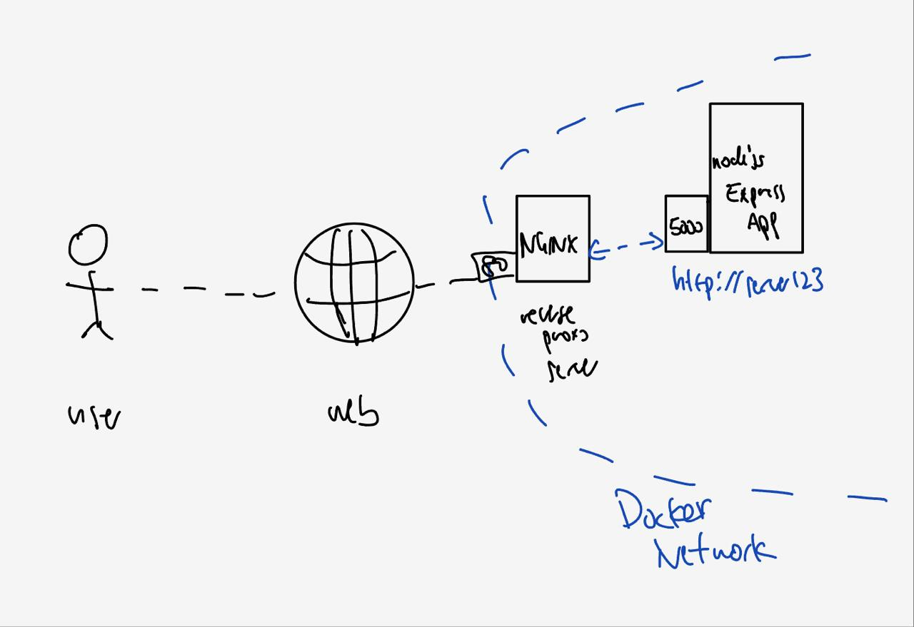

# Dockerized Express app with Nginx as reverse proxy server
- nginx exposes port80 to outside world
- incoming requests to nginx are passed to express app `express app not exposed to outside world` 
- express app hostname is container_name given in compose.yml file. if container_name == 'server123', nginx will pass request to http:// server123 :port
- creates custom-nginx image with custom config copied over. `can also mount custom config instead of building image`




# useful docker cli commands
```sh
compose_fname=docker-compose.yml
docker compose -f $compose_fname up

docker compose -f $compose_fname down
docker rmi server123 custom_nginx
```

